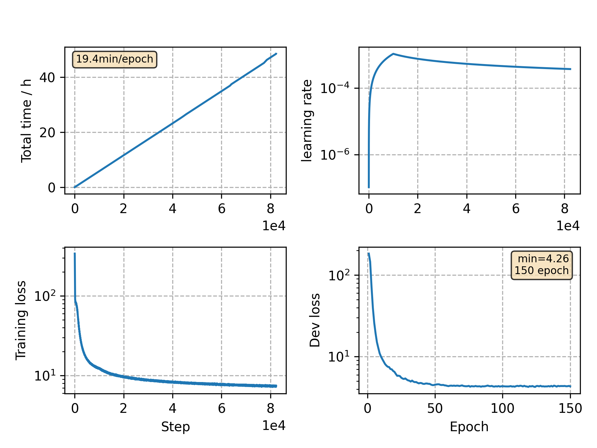

### Basic info

**This part is auto generated, add your details in Appendix**

* Model size/M: 62.24
* GPU info \[9\]
  * \[9\] GeForce RTX 3090

### Appendix

* same encoder as the ASRU advancing libri model

### WER
```
Custom checkpoint: avg_best_10.pt
Use CPU = False
test_clean ext_lm= %WER 2.68 [1407 / 52576, 182 ins, 88 del, 1137 sub ]
    oracle %WER 1.99 [1048 / 52576, 128 ins, 69 del, 851 sub ]
test_other ext_lm= %WER 6.28 [3288 / 52343, 395 ins, 240 del, 2653 sub ]
    oracle %WER 5.22 [2734 / 52343, 323 ins, 190 del, 2221 sub ]

Custom checkpoint: avg_last_10.pt
Use CPU = False
test_clean ext_lm= %WER 2.64 [1390 / 52576, 179 ins, 103 del, 1108 sub ]
    oracle %WER 1.97 [1037 / 52576, 129 ins, 72 del, 836 sub ]
test_other ext_lm= %WER 6.28 [3286 / 52343, 399 ins, 247 del, 2640 sub ]
    oracle %WER 5.12 [2682 / 52343, 308 ins, 196 del, 2178 sub ]
```

### Monitor figure


commit: `6167f761eabfd08d52251dab62dd57d7dec66964`
