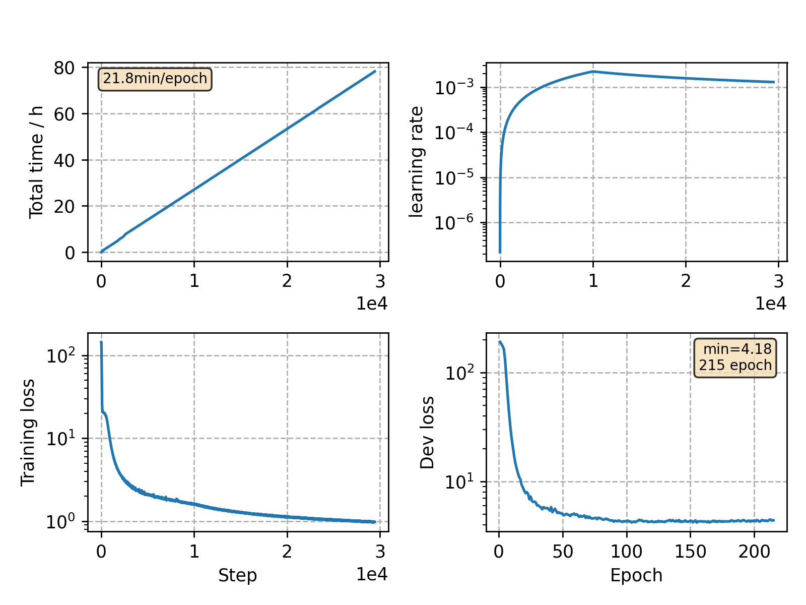

### Basic info

**This part is auto-generated, add your details in Appendix**

* Model size/M: 120.42
* GPU info \[9\]
  * \[9\] GeForce RTX 3090

### Appendix

* follow google 2048 batch size and large conformer

### Result
```
baseline ALSD 16
test-clean/test-other   2.38/5.40

RNA 16
dev_clean       %SER 27.64 | %WER 2.18 [1185 / 54402, 126 ins, 100 del, 959 sub ]
dev_other       %SER 45.32 | %WER 5.34 [2720 / 50948, 251 ins, 218 del, 2251 sub ]
test_clean      %SER 28.55 | %WER 2.39 [1259 / 52576, 145 ins, 101 del, 1013 sub ]
test_other      %SER 46.48 | %WER 5.41 [2830 / 52343, 302 ins, 238 del, 2290 sub ]
tlv2-dev        %SER 86.39 | %WER 11.67 [ 2075 / 17783, 521 ins, 297 del, 1257 sub ]
tlv2-test       %SER 77.06 | %WER 11.40 [ 3135 / 27500, 548 ins, 581 del, 2006 sub ]

+lm-v10 tuned
%SER 24.71 | %WER 1.88 [ 1025 / 54402, 106 ins, 105 del, 814 sub ]    alpha = 0.625 | beta = 0.25
%SER 37.92 | %WER 4.35 [ 2217 / 50948, 205 ins, 192 del, 1820 sub ]   alpha = 0.75 | beta = 0.75
%SER 24.66 | %WER 2.00 [ 1054 / 52576, 120 ins, 102 del, 832 sub ]    alpha = 0.53125 | beta = 1.0
%SER 40.29 | %WER 4.53 [ 2373 / 52343, 245 ins, 247 del, 1881 sub ]   alpha = 0.71875 | beta = 0.5
%SER 84.62 | %WER 11.05 [ 1965 / 17783, 489 ins, 298 del, 1178 sub ]  alpha = 0.53125 | beta = 1.5
%SER 74.20 | %WER 10.56 [ 2905 / 27500, 492 ins, 591 del, 1822 sub ]  alpha = 0.5 | beta = 1.75

+lm-v12 tuned
%SER 25.93 | %WER 2.04 [ 1109 / 54402, 112 ins, 105 del, 892 sub ]  alpha = 0.375 | beta = 1.0
%SER 40.61 | %WER 4.76 [ 2426 / 50948, 221 ins, 217 del, 1988 sub ] alpha = 0.5 | beta = 1.0
%SER 26.76 | %WER 2.19 [ 1151 / 52576, 131 ins, 108 del, 912 sub ]  alpha = 0.5 | beta = 0.75
%SER 43.45 | %WER 4.90 [ 2567 / 52343, 261 ins, 252 del, 2054 sub ] alpha = 0.5 | beta = 1.0
%SER 85.40 | %WER 11.25 [ 2000 / 17783, 513 ins, 291 del, 1196 sub ]  alpha = 0.3125 | beta = 1.5
%SER 75.50 | %WER 10.82 [ 2976 / 27500, 532 ins, 556 del, 1888 sub ]  alpha = 0.25 | beta = 1.25


+lm-v11 rescored with alpha=0.5 beta=1.03125
dev_clean       %SER 28.23 | %WER 2.25 [1222 / 54402, 118 ins, 127 del, 977 sub ]
dev_other       %SER 43.30 | %WER 5.06 [2577 / 50948, 222 ins, 234 del, 2121 sub ]
test_clean      %SER 29.16 | %WER 2.42 [1274 / 52576, 134 ins, 122 del, 1018 sub ]
test_other      %SER 45.59 | %WER 5.24 [2745 / 52343, 273 ins, 279 del, 2193 sub ]

+lm-v12 rescored with alpha=0.625 beta=1.1875
dev_clean       %SER 26.75 | %WER 2.10 [1141 / 54402, 111 ins, 123 del, 907 sub ]
dev_other       %SER 40.75 | %WER 4.76 [2423 / 50948, 213 ins, 224 del, 1986 sub ]
test_clean      %SER 27.14 | %WER 2.20 [1159 / 52576, 124 ins, 109 del, 926 sub ]
test_other      %SER 43.76 | %WER 4.96 [2594 / 52343, 260 ins, 259 del, 2075 sub ]

+lm-v10 rescored with alpha=0.75 beta=0.875
dev_clean       %SER 25.12 | %WER 1.90 [1034 / 54402, 109 ins, 102 del, 823 sub ]
dev_other       %SER 37.78 | %WER 4.34 [2212 / 50948, 206 ins, 191 del, 1815 sub ]
test_clean      %SER 25.27 | %WER 2.05 [1079 / 52576, 126 ins, 108 del, 845 sub ]
test_other      %SER 40.56 | %WER 4.55 [2383 / 52343, 250 ins, 243 del, 1890 sub ]
```

### Monitor figure

