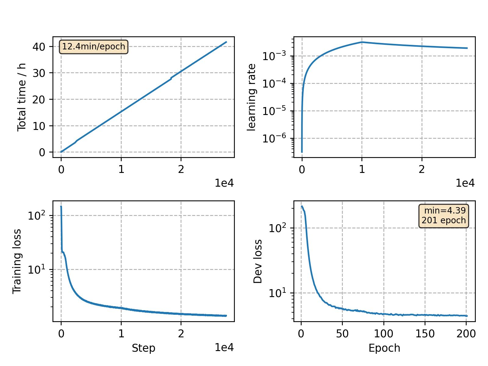

### Basic info

**This part is auto-generated, add your details in Appendix**

* Model size/M: 32.48
* GPU info \[9\]
  * \[9\] NVIDIA GeForce RTX 3090

### Appendix

* `v27` + conformer: large -> medium
* will be baseline for PN mask experiment

### WER
```
Custom checkpoint: avg_last_10.pt | Use CPU = True
test_clean %WER 2.78 [1460 / 52576, 173 ins, 111 del, 1176 sub ]
    oracle %WER 2.19 [1151 / 52576, 126 ins, 78 del, 947 sub ]
test_other %WER 6.44 [3370 / 52343, 356 ins, 275 del, 2739 sub ]
    oracle %WER 5.29 [2769 / 52343, 271 ins, 208 del, 2290 sub ]

Custom checkpoint: avg_best_10.pt | Use CPU = True
test_clean %WER 2.72 [1431 / 52576, 166 ins, 107 del, 1158 sub ]
    oracle %WER 2.18 [1145 / 52576, 127 ins, 77 del, 941 sub ]
test_other %WER 6.45 [3377 / 52343, 356 ins, 275 del, 2746 sub ]
    oracle %WER 5.28 [2764 / 52343, 272 ins, 209 del, 2283 sub ]
```

### Monitor figure


commit: `2fcdf3aec921022c2a084bd5048a96116e0d3e9b`
