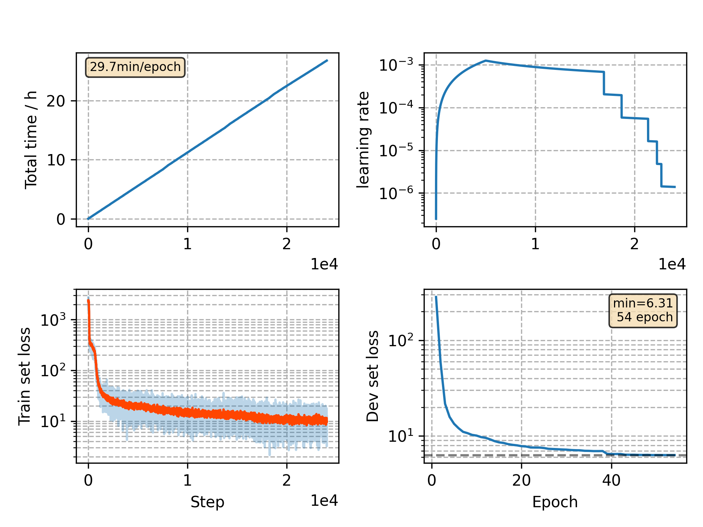

### Basic info

**This part is auto generated, add your details in Appendix**

* Model size/M: ~13
* GPU info \[9\]
  * \[9\] GeForce RTX 3090

### Appendix

* PN pretrained from LM, TN pretrained from phone-CTC-CRF
* No frozen module in joint training
* incompatible with new `*_process.py`

### WER
```
%WER 5.35 [ 2814 / 52576, 518 ins, 219 del, 2077 sub ]
%WER 12.66 [ 6628 / 52343, 966 ins, 618 del, 5044 sub ]
%WER 4.79 [ 2605 / 54402, 430 ins, 213 del, 1962 sub ]
%WER 12.25 [ 6239 / 50948, 775 ins, 626 del, 4838 sub ]
```

### Monitor figure

