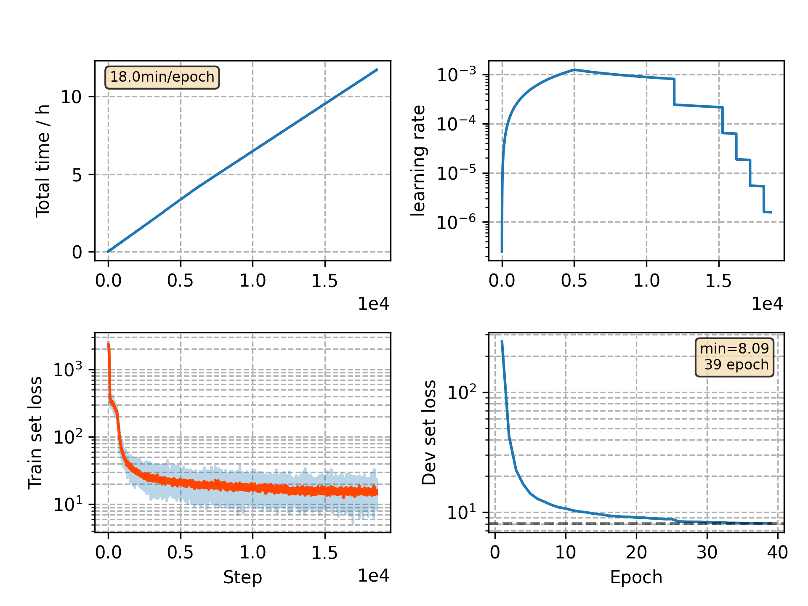

### Basic info

**This part is auto generated, add your details in Appendix**

* Model size/M: 5.52
* GPU info \[5\]
  * \[5\] GeForce RTX 3090

### Appendix

* Pre-trained and fixed PN & TN
* Stack extra 2 LSTM on TN in joint-training

### WER
```
%WER 6.44 [ 3384 / 52576, 561 ins, 323 del, 2500 sub ]
%WER 15.06 [ 7882 / 52343, 922 ins, 971 del, 5989 sub ]
%WER 5.96 [ 3241 / 54402, 455 ins, 302 del, 2484 sub ]
%WER 14.87 [ 7576 / 50948, 821 ins, 995 del, 5760 sub ]
```

### Monitor figure

