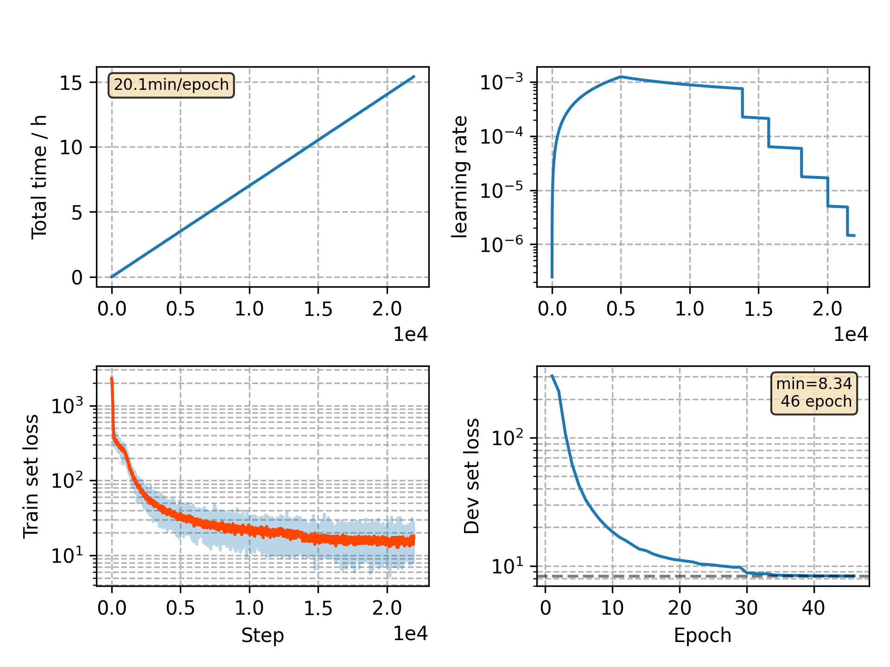

### Basic info

**This part is auto generated, add your details in Appendix**

* Model size/M: 8.65
* GPU info \[5\]
  * \[5\] GeForce RTX 3090

### Appendix

* 2-gram PN

### WER
```
lm=0.0
%WER 7.94 [ 4172 / 52576, 622 ins, 363 del, 3187 sub ]
%WER 17.00 [ 8898 / 52343, 1094 ins, 981 del, 6823 sub ]
%WER 7.55 [ 4105 / 54402, 548 ins, 337 del, 3220 sub ]
%WER 17.16 [ 8743 / 50948, 952 ins, 969 del, 6822 sub ]

lm=0.3
%WER 6.28 [ 3302 / 52576, 552 ins, 350 del, 2400 sub ]
%WER 14.29 [ 7479 / 52343, 1011 ins, 905 del, 5563 sub ]
%WER 5.84 [ 3177 / 54402, 480 ins, 303 del, 2394 sub ]
%WER 14.47 [ 7370 / 50948, 890 ins, 871 del, 5609 sub ]
```

### Monitor figure

