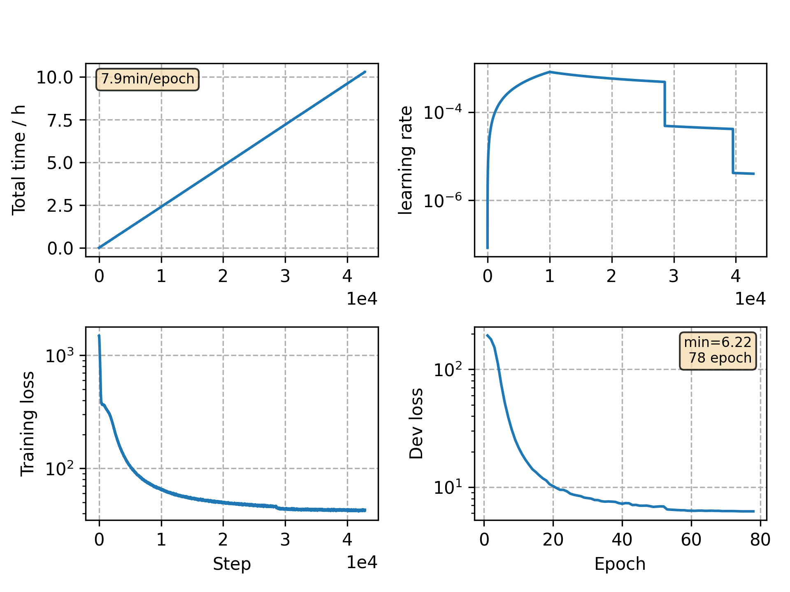

### Basic info

**This part is auto generated, add your details in Appendix**

* Model size/M: 10.33
* GPU info \[9\]
  * \[9\] GeForce RTX 3090

### Appendix

* 

### WER
```
result is unreliable since --databalance bug, see rnnt-v23

%WER 4.64 [ 2437 / 52576, 309 ins, 183 del, 1945 sub ]
%WER 11.54 [ 6041 / 52343, 747 ins, 492 del, 4802 sub ]
```

### Monitor figure

