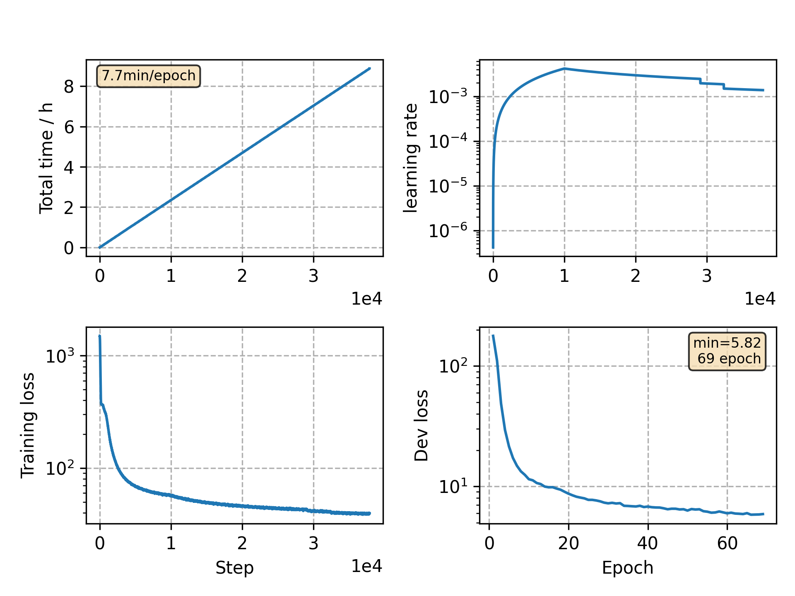

### Basic info

**This part is auto generated, add your details in Appendix**

* Model size/M: 10.33
* GPU info \[9\]
  * \[9\] GeForce RTX 3090

### Appendix

* `v19` + peak factor 1.0 -> 5.0
* stop criterion is eased

### WER
```
result is unreliable since --databalance bug, see rnnt-v23

%WER 4.50 [ 2367 / 52576, 308 ins, 157 del, 1902 sub ]
%WER 10.76 [ 5630 / 52343, 725 ins, 467 del, 4438 sub ]
# with model average last 8
test_clean %WER 4.30 [2262 / 52576, 292 ins, 150 del, 1820 sub ]
test_other %WER 10.17 [5322 / 52343, 652 ins, 405 del, 4265 sub ]
```

### Monitor figure

