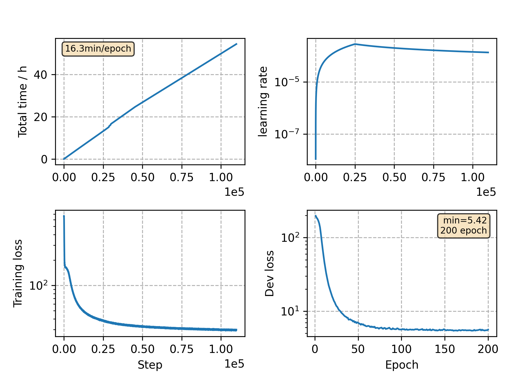

### Basic info

**This part is auto generated, add your details in Appendix**

* Model size/M: 81.01
* GPU info \[9\]
  * \[9\] GeForce RTX 3090

### Appendix

* follow the settings of aishell `v14`

### WER
```
Use CPU = False
test_clean ext_lm= %WER 3.19 [1677 / 52576, 208 ins, 123 del, 1346 sub ]
test_other ext_lm= %WER 7.89 [4130 / 52343, 440 ins, 314 del, 3376 sub ]

Custom checkpoint: avg_best_10.pt
Use CPU = False
test_clean ext_lm= %WER 2.97 [1564 / 52576, 197 ins, 122 del, 1245 sub ]
test_other ext_lm= %WER 7.31 [3824 / 52343, 421 ins, 306 del, 3097 sub ]

Custom checkpoint: avg_last_10.pt
Use CPU = False
test_clean ext_lm= %WER 2.98 [1567 / 52576, 196 ins, 116 del, 1255 sub ]
test_other ext_lm= %WER 7.26 [3802 / 52343, 403 ins, 311 del, 3088 sub ]
```

### Monitor figure


commit: `26e397b4101538958873e462c34ec09b48183797`
