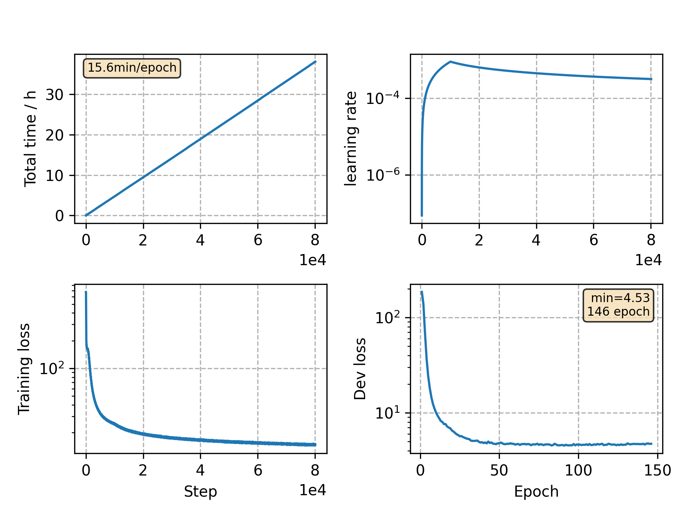

### Basic info

**This part is auto generated, add your details in Appendix**

* Model size/M: 81.01
* GPU info \[9\]
  * \[9\] GeForce RTX 3090

### Appendix

* same model as `v24`, but adjust scheduler lr
* seems overfitting after ~100 epoch training

### WER
```
best-10
test_clean      %WER 2.70 [1417 / 52576, 182 ins, 103 del, 1132 sub ]
test_clean      %WER 2.20 [1159 / 52576, 149 ins, 72 del, 938 sub ]
test_other      %WER 6.70 [3506 / 52343, 397 ins, 290 del, 2819 sub ]
test_other      %WER 5.61 [2939 / 52343, 321 ins, 234 del, 2384 sub ]

last-10
test_clean      %WER 2.72 [1432 / 52576, 165 ins, 109 del, 1158 sub ]
test_clean      %WER 2.25 [1184 / 52576, 138 ins, 78 del, 968 sub ]
test_other      %WER 6.55 [3426 / 52343, 397 ins, 294 del, 2735 sub ]
test_other      %WER 5.55 [2904 / 52343, 323 ins, 231 del, 2350 sub ]
```

### Monitor figure


commit: `95bb394a0acdc7220c5a5e29eda30bf76bb4aff3`