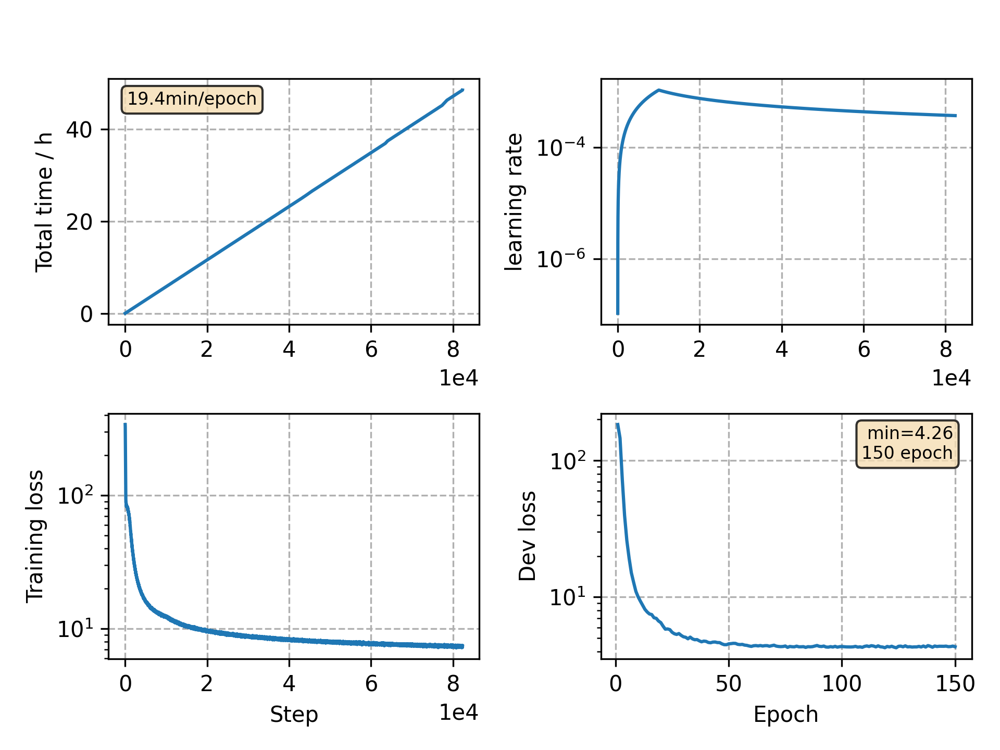

### Basic info

**This part is auto generated, add your details in Appendix**

* Model size/M: 62.24
* GPU info \[9\]
  * \[9\] GeForce RTX 3090

### Appendix

* same encoder as the ASRU advancing libri model

### WER
```
test_clean      %WER 2.66 [1400 / 52576, 180 ins, 88 del, 1132 sub ]
test_clean      %WER 2.20 [1157 / 52576, 144 ins, 75 del, 938 sub ]
test_other      %WER 6.27 [3282 / 52343, 392 ins, 242 del, 2648 sub ]
test_other      %WER 5.27 [2759 / 52343, 327 ins, 191 del, 2241 sub ]
```

### Monitor figure

