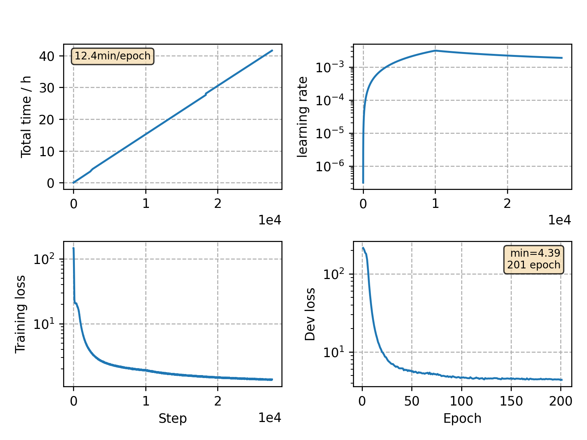

### Basic info

**This part is auto-generated, add your details in Appendix**

* Model size/M: 32.48
* GPU info \[9\]
  * \[9\] NVIDIA GeForce RTX 3090

### Appendix

* `v27` + conformer: large -> medium
* will be baseline for PN mask experiment

### Result
```
test_clean      %WER 2.72 [1431 / 52576, 166 ins, 107 del, 1158 sub ]
test_clean      %WER 2.18 [1145 / 52576, 127 ins, 77 del, 941 sub ]
test_other      %WER 6.45 [3377 / 52343, 356 ins, 275 del, 2746 sub ]
test_other      %WER 5.28 [2764 / 52343, 272 ins, 209 del, 2283 sub ]
```

### Monitor figure

