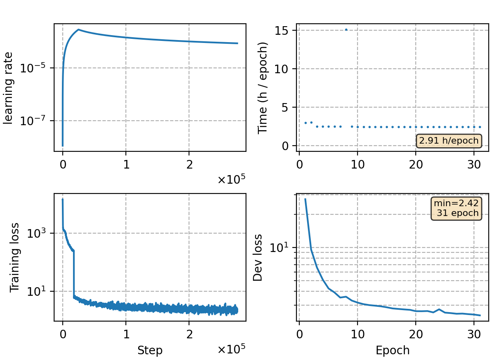

### Basic info

**This part is auto-generated, add your details in Appendix**

* Model size/M: 92.10
* GPU info \[10\]
  * \[10\] NVIDIA GeForce RTX 3090

### Appendix

* updated dataloader, using webdataset, trained on clean 4.5k hours data.
* training by 30 epochs (around 300k steps)


### Result
```
aidatatang-test %SER 11.18 | %CER 1.56 [ 5389 / 344629, 437 ins, 822 del, 4130 sub ]
cntv-test       %SER 80.06 | %CER 13.14 [ 10030 / 76327, 371 ins, 1742 del, 7917 sub ]
kingline-test   %SER 94.07 | %CER 48.70 [ 45342 / 93100, 2165 ins, 2746 del, 40431 sub ]
aishell-test    %SER 14.35 | %CER 1.34 [ 1408 / 104765, 44 ins, 79 del, 1285 sub ]
hunan-test      %SER 80.33 | %CER 43.33 [ 67791 / 156437, 3945 ins, 25970 del, 37876 sub ]
yys-test        %SER 73.57 | %CER 38.58 [ 59713 / 154764, 2786 ins, 25502 del, 31425 sub ]
speechio_asr_zh00000    %SER 72.81 | %CER 8.69 [ 2066 / 23765, 54 ins, 351 del, 1661 sub ]
speechio_asr_zh00001    %SER 53.01 | %CER 4.61 [ 6606 / 143203, 43 ins, 412 del, 6151 sub ]
speechio_asr_zh00002    %SER 73.37 | %CER 15.15 [ 7812 / 51551, 229 ins, 1833 del, 5750 sub ]
speechio_asr_zh00003    %SER 83.78 | %CER 17.47 [ 6476 / 37064, 45 ins, 1111 del, 5320 sub ]
speechio_asr_zh00004    %SER 67.73 | %CER 6.19 [ 2321 / 37506, 72 ins, 473 del, 1776 sub ]
speechio_asr_zh00005    %SER 80.05 | %CER 8.91 [ 8314 / 93322, 184 ins, 1674 del, 6456 sub ]
speechio_asr_zh00006    %SER 85.84 | %CER 21.42 [ 5637 / 26318, 156 ins, 864 del, 4617 sub ]
speechio_asr_zh00007    %SER 93.51 | %CER 27.61 [ 5199 / 18832, 95 ins, 1546 del, 3558 sub ]
```

### Monitor figure

