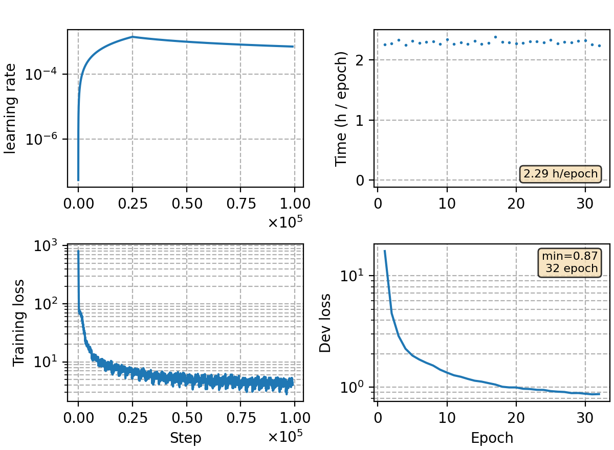

### Basic info

**This part is auto-generated, add your details in Appendix**

* Model size/M: 92.10
* GPU info \[18\]
  * \[18\] NVIDIA GeForce RTX 3090

### Appendix

* train the tasi 4.5k + 4.5k noise data with Conformer RNN-T
* use large batch size to leverage the communication overhead between nodes
* training 100k steps (32 epochs)

### Result
```
cntv-test       %SER 79.78 | %CER 12.78 [ 9752 / 76327, 403 ins, 1507 del, 7842 sub ]
kingline-test   %SER 92.22 | %CER 44.58 [ 41507 / 93100, 2225 ins, 2221 del, 37061 sub ]
aishell-test    %SER 8.43 | %CER 0.73 [ 768 / 104765, 35 ins, 63 del, 670 sub ]
hunan-test      %SER 76.76 | %CER 39.11 [ 61183 / 156437, 4739 ins, 16215 del, 40229 sub ]
yys-test        %SER 71.04 | %CER 35.55 [ 55015 / 154764, 2990 ins, 19106 del, 32919 sub ]
speechio_asr_zh00000    %SER 72.13 | %CER 8.18 [ 1943 / 23765, 45 ins, 301 del, 1597 sub ]
speechio_asr_zh00001    %SER 57.98 | %CER 5.54 [ 7934 / 143203, 38 ins, 671 del, 7225 sub ]
speechio_asr_zh00002    %SER 71.27 | %CER 13.82 [ 7122 / 51551, 234 ins, 1543 del, 5345 sub ]
speechio_asr_zh00003    %SER 82.77 | %CER 15.00 [ 5558 / 37064, 59 ins, 456 del, 5043 sub ]
speechio_asr_zh00004    %SER 68.42 | %CER 6.61 [ 2481 / 37506, 67 ins, 374 del, 2040 sub ]
speechio_asr_zh00005    %SER 81.42 | %CER 9.32 [ 8697 / 93322, 171 ins, 1613 del, 6913 sub ]
speechio_asr_zh00006    %SER 87.06 | %CER 23.08 [ 6073 / 26318, 164 ins, 892 del, 5017 sub ]
speechio_asr_zh00007    %SER 94.16 | %CER 30.19 [ 5686 / 18832, 68 ins, 1719 del, 3899 sub ]
```

### Monitor figure

