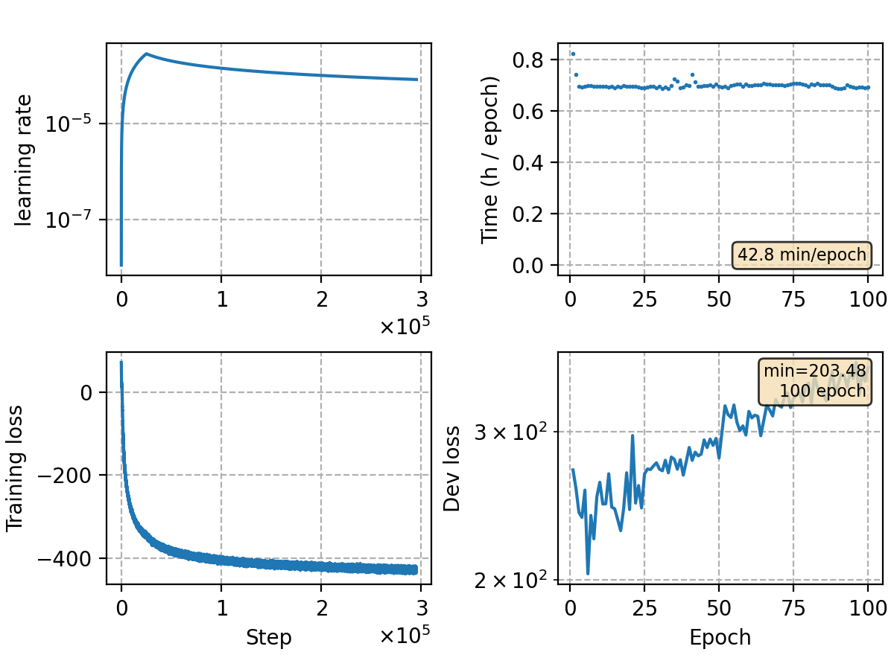

### Basic info

**This part is auto-generated, add your details in Appendix**

* Model size/M: 83.45
* GPU info \[10\]
  * \[10\] NVIDIA GeForce RTX 3090

### Appendix

* data prepare and decode: `/mnt/workspace/zhenghh/CAT/egs/wenetspeech/run.sh`
* The dev set was processed in error, so the monitor plotting of dev loss is meaningless. However, this didn't affect the result, since I take the last 10 checkpoints for model averaging.

### Result
```
%WER 11.15 [ 36536 / 327711, 2727 ins, 12405 del, 21404 sub ] exp/crf-v1/phn-tgprune/dev/cer_7_0.0
%WER 13.38 [ 55453 / 414392, 2590 ins, 12334 del, 40529 sub ] exp/crf-v1/phn-tgprune/test_net/cer_9_0.0
%WER 20.52 [ 45219 / 220338, 1968 ins, 17993 del, 25258 sub ] exp/crf-v1/phn-tgprune/test_meeting/cer_7_0.0
%WER 6.43 [ 13199 / 205341, 412 ins, 548 del, 12239 sub ] exp/crf-v1/decodelm/aishell-dev-20-20/cer_11_1.0
%WER 6.83 [ 7153 / 104765, 191 ins, 430 del, 6532 sub ] exp/crf-v1/phn-tgprune/aishell-test/cer_12_1.0

+aishell word
%WER 5.53 [ 5795 / 104765, 191 ins, 370 del, 5234 sub ] exp/crf-v1/phn-word-3gram/aishell-test/cer_12_0.5

+aishell char
%WER 6.86 [ 7192 / 104765, 160 ins, 432 del, 6600 sub ] exp/crf-v1/phn-char-5gram/aishell-test/cer_12_1.0

char trans
%WER 12.14 [ 39792 / 327711, 2775 ins, 12515 del, 24502 sub ] exp/crf-v1/phn-char-5gram/dev/cer_7_0.0
%WER 14.44 [ 59848 / 414392, 2705 ins, 12336 del, 44807 sub ] exp/crf-v1/phn-char-5gram/test_net/cer_9_0.0
%WER 21.62 [ 47629 / 220338, 2037 ins, 18180 del, 27412 sub ] exp/crf-v1/phn-char-5gram/test_meeting/cer_7_0.0
%WER 8.52 [ 8929 / 104765, 164 ins, 541 del, 8224 sub ] exp/crf-v1/phn-char-5gram/aishell-test/cer_13_1.0
```
LM adaptation

```
>>> w/o LM
    %WER 6.43 [ 13199 / 205341, 412 ins, 548 del, 12239 sub ] exp/crf-v1/decodelm/aishell-dev-20-20/cer_11_1.0
    %WER 6.83 [ 7153 / 104765, 191 ins, 430 del, 6532 sub ] exp/crf-v1/phn-tgprune/aishell-test/cer_12_1.0

>>> + lm-aishell
    %WER 5.03 [ 10331 / 205341, 378 ins, 440 del, 9513 sub ] exp/crf-v1/phn_word_3gram_aishell/aishell-dev/cer_11_0.5
    %WER 5.54 [ 5800 / 104765, 190 ins, 370 del, 5240 sub ] exp/crf-v1/phn_word_3gram_aishell/aishell-test/cer_12_0.5

```

LM integration

```
>>> evaluate on combine-set with lm-trans
%SER 64.99 | %CER 8.76 [ 46980 / 536326, 2134 ins, 11611 del, 33235 sub ]       [0.875, 2.875]
    %SER 53.58 | %CER 7.98 [ 8361 / 104765, 468 ins, 111 del, 7782 sub ]
    %SER 77.25 | %CER 10.67 [ 2535 / 23765, 89 ins, 1411 del, 1035 sub ]
    %SER 55.20 | %CER 4.50 [ 6447 / 143203, 93 ins, 388 del, 5966 sub ]
    %SER 62.45 | %CER 9.23 [ 4759 / 51551, 521 ins, 1345 del, 2893 sub ]
    %SER 66.49 | %CER 6.99 [ 2591 / 37064, 95 ins, 69 del, 2427 sub ]
    %SER 69.26 | %CER 6.11 [ 2291 / 37506, 146 ins, 577 del, 1568 sub ]
    %SER 86.53 | %CER 9.94 [ 9278 / 93322, 274 ins, 4425 del, 4579 sub ]
    %SER 86.74 | %CER 24.14 [ 6352 / 26318, 254 ins, 1882 del, 4216 sub ]
    %SER 92.47 | %CER 24.33 [ 4582 / 18832, 230 ins, 1365 del, 2987 sub ]

>>> + lm-vary/trans_5m
%SER 51.79 | %CER 7.04 [ 37755 / 536326, 2310 ins, 11739 del, 23706 sub ]       [0.875, 3.875]
    %SER 36.97 | %CER 4.85 [ 5079 / 104765, 519 ins, 116 del, 4444 sub ]
    %SER 68.94 | %CER 9.88 [ 2348 / 23765, 99 ins, 1451 del, 798 sub ]
    %SER 28.05 | %CER 2.09 [ 2995 / 143203, 75 ins, 390 del, 2530 sub ]
    %SER 60.84 | %CER 8.79 [ 4531 / 51551, 603 ins, 1322 del, 2606 sub ]
    %SER 41.83 | %CER 3.79 [ 1403 / 37064, 95 ins, 67 del, 1241 sub ]
    %SER 63.16 | %CER 5.38 [ 2017 / 37506, 153 ins, 569 del, 1295 sub ]
    %SER 84.56 | %CER 9.31 [ 8692 / 93322, 268 ins, 4549 del, 3875 sub ]
    %SER 85.91 | %CER 23.50 [ 6185 / 26318, 300 ins, 1879 del, 4006 sub ]
    %SER 91.95 | %CER 24.03 [ 4525 / 18832, 247 ins, 1366 del, 2912 sub ]

10m
    %SER 35.10 | %CER 4.55 [ 4763 / 104765, 513 ins, 116 del, 4134 sub ]
    %SER 68.15 | %CER 9.93 [ 2361 / 23765, 96 ins, 1486 del, 779 sub ]
    %SER 26.87 | %CER 2.03 [ 2902 / 143203, 74 ins, 393 del, 2435 sub ]
    %SER 60.11 | %CER 8.68 [ 4473 / 51551, 593 ins, 1331 del, 2549 sub ]
    %SER 40.76 | %CER 3.59 [ 1330 / 37064, 86 ins, 67 del, 1177 sub ]
    %SER 62.93 | %CER 5.34 [ 2001 / 37506, 152 ins, 578 del, 1271 sub ]
    %SER 84.69 | %CER 9.30 [ 8680 / 93322, 262 ins, 4617 del, 3801 sub ]
    %SER 85.97 | %CER 23.33 [ 6139 / 26318, 293 ins, 1884 del, 3962 sub ]
    %SER 92.34 | %CER 24.09 [ 4536 / 18832, 237 ins, 1380 del, 2919 sub ]

20m
    %SER 33.46 | %CER 4.27 [ 4478 / 104765, 486 ins, 123 del, 3869 sub ]
    %SER 66.89 | %CER 9.85 [ 2340 / 23765, 94 ins, 1498 del, 748 sub ]
    %SER 26.06 | %CER 1.97 [ 2827 / 143203, 78 ins, 408 del, 2341 sub ]
    %SER 60.27 | %CER 8.49 [ 4376 / 51551, 581 ins, 1339 del, 2456 sub ]
    %SER 37.73 | %CER 3.33 [ 1233 / 37064, 83 ins, 70 del, 1080 sub ]
    %SER 62.17 | %CER 5.26 [ 1973 / 37506, 145 ins, 577 del, 1251 sub ]
    %SER 84.63 | %CER 9.21 [ 8598 / 93322, 260 ins, 4629 del, 3709 sub ]
    %SER 85.84 | %CER 23.21 [ 6109 / 26318, 288 ins, 1887 del, 3934 sub ]
    %SER 91.95 | %CER 23.92 [ 4505 / 18832, 232 ins, 1385 del, 2888 sub ]

40m
    %SER 32.19 | %CER 4.09 [ 4288 / 104765, 467 ins, 118 del, 3703 sub ]
    %SER 66.33 | %CER 9.79 [ 2326 / 23765, 95 ins, 1514 del, 717 sub ]
    %SER 25.59 | %CER 1.93 [ 2769 / 143203, 77 ins, 406 del, 2286 sub ]
    %SER 59.20 | %CER 8.43 [ 4347 / 51551, 579 ins, 1362 del, 2406 sub ]
    %SER 36.30 | %CER 3.13 [ 1159 / 37064, 81 ins, 71 del, 1007 sub ]
    %SER 61.71 | %CER 5.11 [ 1916 / 37506, 136 ins, 580 del, 1200 sub ]
    %SER 84.15 | %CER 9.18 [ 8571 / 93322, 269 ins, 4666 del, 3636 sub ]
    %SER 86.03 | %CER 23.20 [ 6107 / 26318, 292 ins, 1893 del, 3922 sub ]
    %SER 92.08 | %CER 23.77 [ 4476 / 18832, 237 ins, 1391 del, 2848 sub ]

80m
    %SER 30.60 | %CER 3.85 [ 4030 / 104765, 437 ins, 116 del, 3477 sub ]
    %SER 66.10 | %CER 9.84 [ 2338 / 23765, 94 ins, 1524 del, 720 sub ]
    %SER 25.23 | %CER 1.88 [ 2686 / 143203, 73 ins, 407 del, 2206 sub ]
    %SER 59.44 | %CER 8.36 [ 4308 / 51551, 583 ins, 1367 del, 2358 sub ]
    %SER 35.53 | %CER 3.05 [ 1131 / 37064, 78 ins, 70 del, 983 sub ]
    %SER 61.25 | %CER 5.06 [ 1896 / 37506, 142 ins, 586 del, 1168 sub ]
    %SER 84.56 | %CER 9.18 [ 8568 / 93322, 275 ins, 4702 del, 3591 sub ]
    %SER 84.95 | %CER 23.06 [ 6069 / 26318, 282 ins, 1900 del, 3887 sub ]
    %SER 91.56 | %CER 23.53 [ 4431 / 18832, 233 ins, 1400 del, 2798 sub ]

200m
    %SER 29.32 | %CER 3.61 [ 3785 / 104765, 421 ins, 124 del, 3240 sub ]
    %SER 66.55 | %CER 9.80 [ 2328 / 23765, 94 ins, 1531 del, 703 sub ]
    %SER 24.92 | %CER 1.84 [ 2634 / 143203, 72 ins, 414 del, 2148 sub ]
    %SER 58.64 | %CER 8.24 [ 4247 / 51551, 583 ins, 1380 del, 2284 sub ]
    %SER 33.87 | %CER 2.92 [ 1082 / 37064, 80 ins, 70 del, 932 sub ]
    %SER 60.64 | %CER 4.97 [ 1864 / 37506, 139 ins, 588 del, 1137 sub ]
    %SER 84.31 | %CER 9.11 [ 8502 / 93322, 268 ins, 4720 del, 3514 sub ]
    %SER 84.63 | %CER 23.00 [ 6054 / 26318, 270 ins, 1918 del, 3866 sub ]
    %SER 91.04 | %CER 23.34 [ 4395 / 18832, 227 ins, 1409 del, 2759 sub ]
```


### Monitor figure

