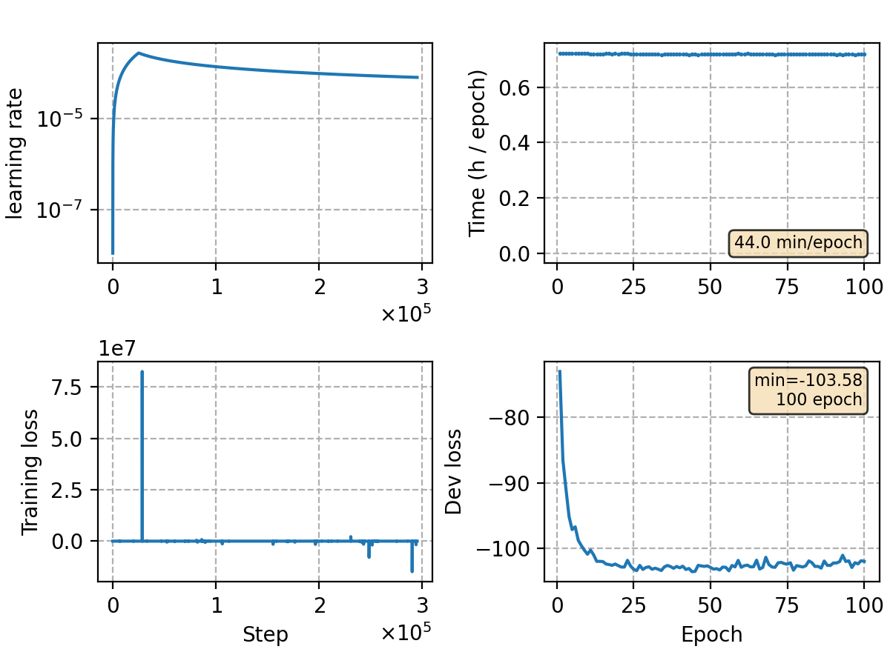

### Basic info

**This part is auto-generated, add your details in Appendix**

* Model size/M: 83.45
* GPU info \[10\]
  * \[10\] NVIDIA GeForce RTX 3090

### Appendix

* error (label input to the crf loss is not converted to `torch.int32`) fixed ver. of `crf-v1`

### Result
```
last 10 epochs
%WER 11.47 [ 37600 / 327711, 2761 ins, 13219 del, 21620 sub ] exp/crf-v1/decode-new/decode_dev/cer_6_0.0
%WER 21.64 [ 47687 / 220338, 2290 ins, 18285 del, 27112 sub ] exp/crf-v1/decode-new/decode_test_meeting/cer_5_0.0
%WER 13.41 [ 55556 / 414392, 2563 ins, 13308 del, 39685 sub ] exp/crf-v1/decode-new/decode_test_net/cer_9_0.0
%WER 6.78 [ 7107 / 104765, 187 ins, 336 del, 6584 sub ] exp/crf-v1/decode-new/decode_aishell-test/cer_11_1.0
```

### Monitor figure

