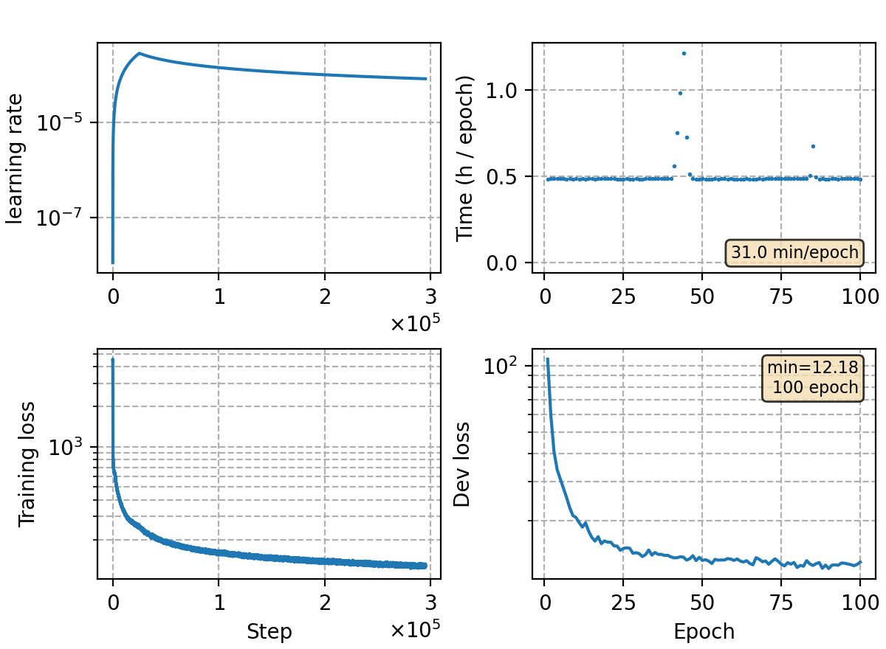

### Basic info

**This part is auto-generated, add your details in Appendix**

* Model size/M: 83.37
* GPU info \[10\]
  * \[10\] NVIDIA GeForce RTX 3090

### Appendix

* CTC topo of `rnnt-v1`

### Result
```
test_meeting    %SER 95.05 | %CER 24.04 [52979 / 220385, 1346 ins, 21329 del, 30304 sub ]
test_net        %SER 74.35 | %CER 15.44 [64172 / 415746, 2045 ins, 14216 del, 47911 sub ]
dev     %SER 76.34 | %CER 12.24 [40467 / 330498, 1272 ins, 15956 del, 23239 sub ]
aishell-test    %SER 59.98 | %CER 8.78 [9202 / 104765, 339 ins, 187 del, 8676 sub ]

0.2
dev     %SER 72.51 | %CER 11.49 [37985 / 330498, 1279 ins, 16235 del, 20471 sub ]

0.4
dev     %SER 72.35 | %CER 11.92 [39409 / 330498, 1056 ins, 19281 del, 19072 sub ]


```

### Tuning on aishell-1

```
alpha 0.4
aishell-test    %SER 44.41 | %CER 6.17 [6461 / 104765, 173 ins, 251 del, 6037 sub ]

alpha 0.5
aishell-test    %SER 43.41 | %CER 6.05 [6338 / 104765, 144 ins, 316 del, 5878 sub ]

alpha 0.55
aishell-test    %SER 43.14 | %CER 6.05 [6339 / 104765, 141 ins, 358 del, 5840 sub ]

alpha 0.6
aishell-test    %SER 43.17 | %CER 6.06 [6350 / 104765, 133 ins, 400 del, 5817 sub ]

```

### Monitor figure

