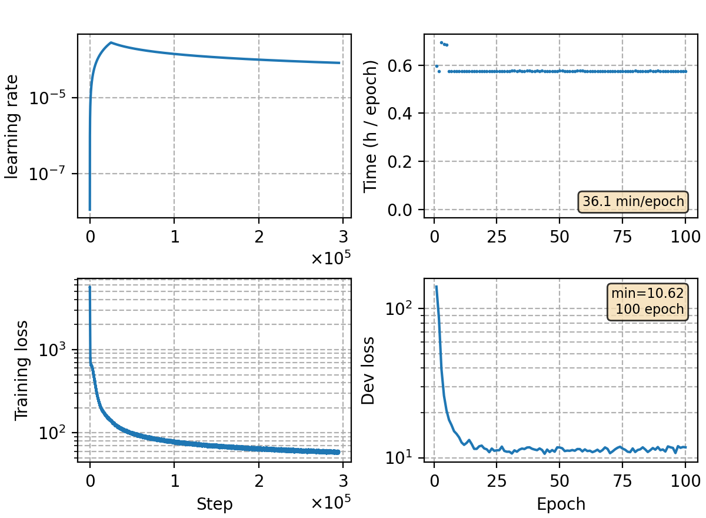

### Basic info

**This part is auto-generated, add your details in Appendix**

* Model size/M: 91.27
* GPU info \[10\]
  * \[10\] NVIDIA GeForce RTX 3090

### Appendix

* trained on wenet speech M subset (1000 hour speech)

### Result
```
no lm
dev     %SER 71.07 | %CER 11.16 [36887 / 330498, 1279 ins, 16227 del, 19381 sub ]
test_meeting  %SER 91.77 | %CER 20.97 [46214 / 220385, 1224 ins, 22925 del, 22065 sub ]
test_net      %SER 65.49 | %CER 12.76 [53035 / 415746, 1943 ins, 12961 del, 38131 sub ]
aishell-test    %SER 49.99 | %CER 7.22 [7560 / 104765, 249 ins, 201 del, 7110 sub ] 

0.25 3.53125
dev     %SER 67.00 | %CER 9.80 [32384 / 330498, 2439 ins, 11058 del, 18887 sub ]
test_meeting    %SER 91.17 | %CER 19.44 [42845 / 220385, 2662 ins, 17412 del, 22771 sub ]
test_net        %SER 63.70 | %CER 12.26 [50975 / 415746, 4384 ins, 8751 del, 37840 sub ]
aishell-test    %SER 47.41 | %CER 6.78 [7105 / 104765, 728 ins, 95 del, 6282 sub ]
```

### Tuning on aishell-1

```
no lm
aishell-test    %SER 49.99 | %CER 7.22 [7560 / 104765, 249 ins, 201 del, 7110 sub ]

+lm trans
Setting: alpha = 0.50 | beta = 1.50
%SER 44.15 | %CER 6.23 [6525 / 104765, 220 ins, 256 del, 6049 sub ]

+lm aishell
Setting: alpha = 0.50 | beta = 1.50
%SER 41.54 | %CER 5.86 [6142 / 104765, 200 ins, 229 del, 5713 sub ]
```

### Monitor figure

