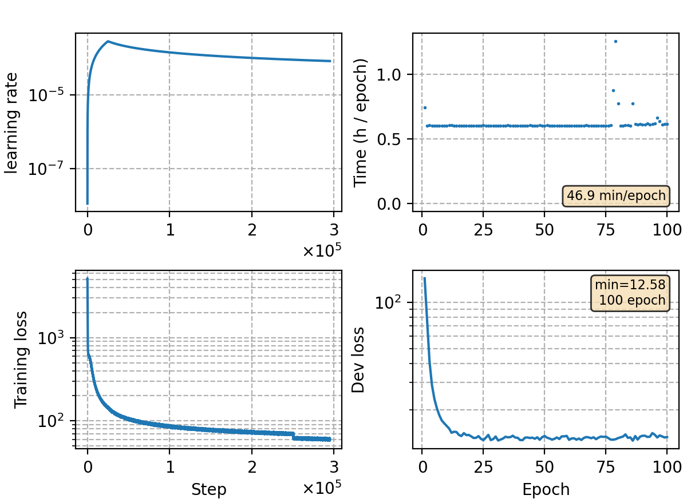

### Basic info

**This part is auto-generated, add your details in Appendix**

* Model size/M: 91.27
* GPU info \[9\]
  * \[9\] NVIDIA GeForce RTX 3090

### Appendix

* train RNN-T with ILM loss 0.4
* differ from the original paper, we train the RNN-T from scratch.

### Result

- beam size 16, batch-rna decoding

| method | dev   | test-net | test-meeting | aishell-test |
| -------| ----- | -------- | ------------ | ------------ |
| ilmt, no lm    | 11.35 | 13.13    | 20.98        | 7.54         |
| ilmt, sf       | 9.49  | 12.54    | 19.02        | 7.00         | 

```
beam 16
dev     %SER 71.41 | %CER 11.35 [ 37498 / 330498, 1255 ins, 16202 del, 20041 sub ]
test_net        %SER 66.31 | %CER 13.13 [ 54580 / 415746, 1963 ins, 12913 del, 39704 sub ]
test_meeting    %SER 92.07 | %CER 20.98 [ 46244 / 220385, 1293 ins, 20936 del, 24015 sub ]
aishell-test    %SER 51.42 | %CER 7.54 [ 7898 / 104765, 257 ins, 305 del, 7336 sub ]

SF + lm-trans 0.25 3.0
dev     %SER 67.21 | %CER 9.49 [ 31354 / 330498, 3422 ins, 8466 del, 19466 sub ]
test_net        %SER 63.83 | %CER 12.54 [ 52155 / 415746, 5923 ins, 7214 del, 39018 sub ]
test_meeting    %SER 90.86 | %CER 19.02 [ 41911 / 220385, 5411 ins, 10776 del, 25724 sub ]
aishell-test    %SER 47.67 | %CER 7.00 [ 7336 / 104765, 838 ins, 111 del, 6387 sub ]
```

### Monitor figure

