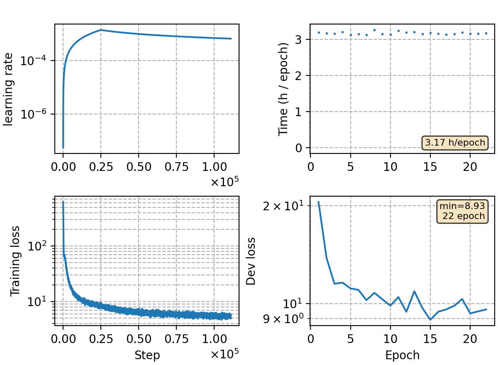

### Basic info

**This part is auto-generated, add your details in Appendix**

* Model size/M: 91.67
* GPU info \[20\]
  * \[20\] NVIDIA GeForce RTX 3090

### Appendix

* train around 100k steps with large batch size
* to accelarate training, utterances with frames more than 1000 are filtered, which reduces the training set by \~40k utterances (\~146,000k in total)

### Result

compared with open sourced toolkit

| Toolkit | Dev  | Test\_Net | Test\_Meeting | AIShell-1 | # iter (epoch) |
|---------|------|:---------:|:-------------:|:---------:|:--------------:|
| Kaldi   | 9.07 |   12.83   |     24.72     |    5.41   |        ?       |
| ESPNet  | 9.70 |    8.90   |     15.90     |    3.90   |       50       |
| WeNet   | 8.88 |    9.70   |     15.59     |    4.61   |       26       |
| ours    | 9.64 |    9.69   |     17.91     |    5.14   |       22       |
| ours+LM | 7.82 |    9.32   |     14.66     |    5.12   |        -       |


Our detailed results:
```
average 5 best
dev     %SER 66.00 | %CER 9.64 [ 31874 / 330498, 1489 ins, 16684 del, 13701 sub ]
test_net        %SER 57.04 | %CER 9.69 [ 40290 / 415746, 1741 ins, 11959 del, 26590 sub ]
test_meeting    %SER 88.79 | %CER 17.91 [ 39475 / 220385, 1098 ins, 23353 del, 15024 sub ]
aishell-test    %SER 38.92 | %CER 5.14 [ 5380 / 104765, 251 ins, 220 del, 4909 sub ]

+trans lm 0.125 2.375 tuned on dev set
dev     %SER 62.11 | %CER 7.82 [ 25849 / 330498, 3724 ins, 7889 del, 14236 sub ]
test_net        %SER 55.67 | %CER 9.32 [ 38747 / 415746, 4977 ins, 6444 del, 27326 sub ]
test_meeting    %SER 87.32 | %CER 14.66 [ 32312 / 220385, 4403 ins, 10774 del, 17135 sub ]
aishell-test    %SER 38.38 | %CER 5.12 [ 5368 / 104765, 802 ins, 92 del, 4474 sub ]

average 10 best
dev     %SER 66.18 | %CER 9.69 [ 32009 / 330498, 1460 ins, 16758 del, 13791 sub ]
test_net        %SER 56.99 | %CER 9.67 [ 40187 / 415746, 1753 ins, 11844 del, 26590 sub ]
test_meeting    %SER 88.83 | %CER 18.14 [ 39971 / 220385, 1060 ins, 24078 del, 14833 sub ]
aishell-test    %SER 38.87 | %CER 5.13 [ 5371 / 104765, 273 ins, 219 del, 4879 sub ]
```

### Monitor figure

