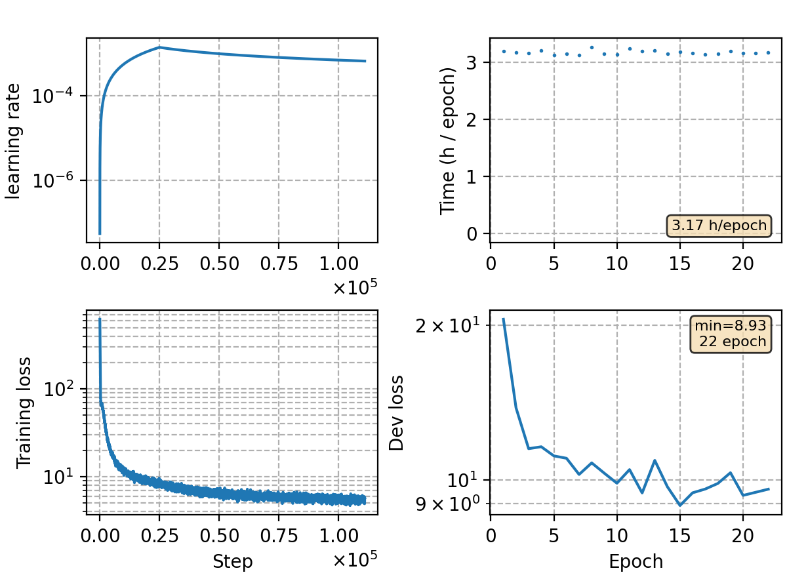

### Basic info

**This part is auto-generated, add your details in Appendix**

* Model size/M: 91.67
* GPU info \[20\]
  * \[20\] NVIDIA GeForce RTX 3090

### Appendix

* train around 100k steps with large batch size
* to accelarate training, utterances with frames more than 1000 are filtered, which reduces the training set by \~40k utterances (\~146,000k in total)

### Result

compared with open sourced toolkit

| Toolkit | Dev  | Test\_Net | Test\_Meeting | AIShell-1 | # iter (epoch) |
|---------|------|:---------:|:-------------:|:---------:|:--------------:|
| Kaldi   | 9.07 |   12.83   |     24.72     |    5.41   |        ?       |
| ESPNet  | 9.70 |    8.90   |     15.90     |    3.90   |       50       |
| WeNet   | 8.88 |    9.70   |     15.59     |    4.61   |       26       |
| ours    | 9.64 |    9.69   |     17.91     |    5.14   |       22       |
| ours+LM | 7.82 |    9.32   |     14.66     |    5.12   |        -       |


Our detailed results:
```
average 5 best
dev     %SER 66.00 | %CER 9.64 [ 31874 / 330498, 1489 ins, 16684 del, 13701 sub ]
test_net        %SER 57.04 | %CER 9.69 [ 40290 / 415746, 1741 ins, 11959 del, 26590 sub ]
test_meeting    %SER 88.79 | %CER 17.91 [ 39475 / 220385, 1098 ins, 23353 del, 15024 sub ]
aishell-test    %SER 38.92 | %CER 5.14 [ 5380 / 104765, 251 ins, 220 del, 4909 sub ]

+trans lm 0.125 2.375 tuned on dev set
dev     %SER 62.11 | %CER 7.82 [ 25849 / 330498, 3724 ins, 7889 del, 14236 sub ]
test_net        %SER 55.67 | %CER 9.32 [ 38747 / 415746, 4977 ins, 6444 del, 27326 sub ]
test_meeting    %SER 87.32 | %CER 14.66 [ 32312 / 220385, 4403 ins, 10774 del, 17135 sub ]
aishell-test    %SER 38.38 | %CER 5.12 [ 5368 / 104765, 802 ins, 92 del, 4474 sub ]
```

adapt to aishell

| Method | test |
|:------:|:----:|
| no lm  | 5.13 |
|   SF   | 4.29 |
|  ILME  | 4.19 |
|  LODR  | 4.01 |

```
SF 0.5 1.38
aishell-test    %SER 33.15 | %CER 4.29 [ 4493 / 104765, 210 ins, 345 del, 3938 sub ]

ILME -0.12 0.5 1.12
aishell-test    %SER 33.07 | %CER 4.19 [ 4386 / 104765, 193 ins, 262 del, 3931 sub ]

LODR -0.38 0.63 0.38
aishell-test    %SER 31.97 | %CER 4.01 [ 4196 / 104765, 219 ins, 234 del, 3743 sub ]
```

speechio result
```
best-5 no lm
speechio_asr_zh00000    %SER 64.05 | %CER 9.93 [ 2360 / 23765, 69 ins, 1757 del, 534 sub ]
speechio_asr_zh00001    %SER 34.31 | %CER 2.56 [ 3661 / 143203, 64 ins, 710 del, 2887 sub ]
speechio_asr_zh00002    %SER 51.29 | %CER 6.46 [ 3329 / 51551, 313 ins, 1346 del, 1670 sub ]
speechio_asr_zh00003    %SER 48.90 | %CER 4.42 [ 1640 / 37064, 34 ins, 73 del, 1533 sub ]
speechio_asr_zh00004    %SER 56.45 | %CER 4.17 [ 1564 / 37506, 81 ins, 679 del, 804 sub ]
speechio_asr_zh00005    %SER 81.42 | %CER 7.70 [ 7186 / 93322, 200 ins, 4786 del, 2200 sub ]
speechio_asr_zh00006    %SER 79.05 | %CER 17.33 [ 4560 / 26318, 208 ins, 1542 del, 2810 sub ]
speechio_asr_zh00007    %SER 87.14 | %CER 17.20 [ 3240 / 18832, 176 ins, 1090 del, 1974 sub ]

+trans lm
speechio_asr_zh00000    %SER 60.52 | %CER 6.35 [ 1509 / 23765, 165 ins, 767 del, 577 sub ]
speechio_asr_zh00001    %SER 31.60 | %CER 2.13 [ 3054 / 143203, 181 ins, 232 del, 2641 sub ]
speechio_asr_zh00002    %SER 50.52 | %CER 6.11 [ 3148 / 51551, 748 ins, 688 del, 1712 sub ]
speechio_asr_zh00003    %SER 47.06 | %CER 4.35 [ 1612 / 37064, 160 ins, 55 del, 1397 sub ]
speechio_asr_zh00004    %SER 53.62 | %CER 3.82 [ 1433 / 37506, 190 ins, 406 del, 837 sub ]
speechio_asr_zh00005    %SER 73.48 | %CER 6.03 [ 5624 / 93322, 525 ins, 2726 del, 2373 sub ]
speechio_asr_zh00006    %SER 77.71 | %CER 16.10 [ 4236 / 26318, 658 ins, 499 del, 3079 sub ]
speechio_asr_zh00007    %SER 85.06 | %CER 17.18 [ 3236 / 18832, 459 ins, 627 del, 2150 sub ]
```

LM integration result
```
SF 0.25 3.0
aishell-test            %SER 29.72 | %CER 3.85 [ 4036 / 104765, 730 ins, 92 del, 3214 sub ]
speechio_asr_zh00000    %SER 61.89 | %CER 7.12 [ 1693 / 23765, 183 ins, 932 del, 578 sub ]
speechio_asr_zh00001    %SER 22.10 | %CER 1.43 [ 2051 / 143203, 160 ins, 239 del, 1652 sub ]
speechio_asr_zh00002    %SER 50.82 | %CER 6.08 [ 3132 / 51551, 830 ins, 711 del, 1591 sub ]
speechio_asr_zh00003    %SER 39.16 | %CER 3.50 [ 1298 / 37064, 290 ins, 47 del, 961 sub ]
speechio_asr_zh00004    %SER 53.62 | %CER 4.01 [ 1504 / 37506, 299 ins, 400 del, 805 sub ]
speechio_asr_zh00005    %SER 75.25 | %CER 6.30 [ 5877 / 93322, 741 ins, 2898 del, 2238 sub ]
speechio_asr_zh00006    %SER 78.67 | %CER 16.24 [ 4274 / 26318, 920 ins, 373 del, 2981 sub ]
speechio_asr_zh00007    %SER 85.32 | %CER 17.62 [ 3318 / 18832, 636 ins, 546 del, 2136 sub ]

ILME -0.13 0.38 3.0
aishell-test            %SER 27.88 | %CER 3.63 [ 3801 / 104765, 825 ins, 95 del, 2881 sub ]
speechio_asr_zh00000    %SER 62.23 | %CER 7.58 [ 1801 / 23765, 178 ins, 1079 del, 544 sub ]
speechio_asr_zh00001    %SER 20.20 | %CER 1.30 [ 1868 / 143203, 218 ins, 256 del, 1394 sub ]
speechio_asr_zh00002    %SER 50.99 | %CER 6.13 [ 3161 / 51551, 812 ins, 760 del, 1589 sub ]
speechio_asr_zh00003    %SER 33.57 | %CER 2.77 [ 1025 / 37064, 176 ins, 47 del, 802 sub ]
speechio_asr_zh00004    %SER 52.25 | %CER 3.78 [ 1416 / 37506, 206 ins, 454 del, 756 sub ]
speechio_asr_zh00005    %SER 79.13 | %CER 6.69 [ 6240 / 93322, 592 ins, 3486 del, 2162 sub ]
speechio_asr_zh00006    %SER 77.26 | %CER 15.75 [ 4146 / 26318, 736 ins, 520 del, 2890 sub ]
speechio_asr_zh00007    %SER 85.71 | %CER 17.09 [ 3219 / 18832, 533 ins, 638 del, 2048 sub ]

LODR -0.13 0.38 3.0
aishell-test            %SER 27.81 | %CER 3.61 [ 3781 / 104765, 831 ins, 90 del, 2860 sub ]
speechio_asr_zh00000    %SER 62.23 | %CER 7.55 [ 1794 / 23765, 197 ins, 1029 del, 568 sub ]
speechio_asr_zh00001    %SER 20.42 | %CER 1.30 [ 1867 / 143203, 217 ins, 248 del, 1402 sub ]
speechio_asr_zh00002    %SER 51.19 | %CER 6.12 [ 3155 / 51551, 849 ins, 723 del, 1583 sub ]
speechio_asr_zh00003    %SER 34.05 | %CER 2.76 [ 1023 / 37064, 185 ins, 46 del, 792 sub ]
speechio_asr_zh00004    %SER 51.49 | %CER 3.79 [ 1421 / 37506, 235 ins, 419 del, 767 sub ]
speechio_asr_zh00005    %SER 78.11 | %CER 6.53 [ 6097 / 93322, 629 ins, 3316 del, 2152 sub ]
speechio_asr_zh00006    %SER 77.19 | %CER 16.18 [ 4258 / 26318, 817 ins, 490 del, 2951 sub ]
speechio_asr_zh00007    %SER 85.45 | %CER 17.12 [ 3224 / 18832, 557 ins, 623 del, 2044 sub ]
```

### Monitor figure

