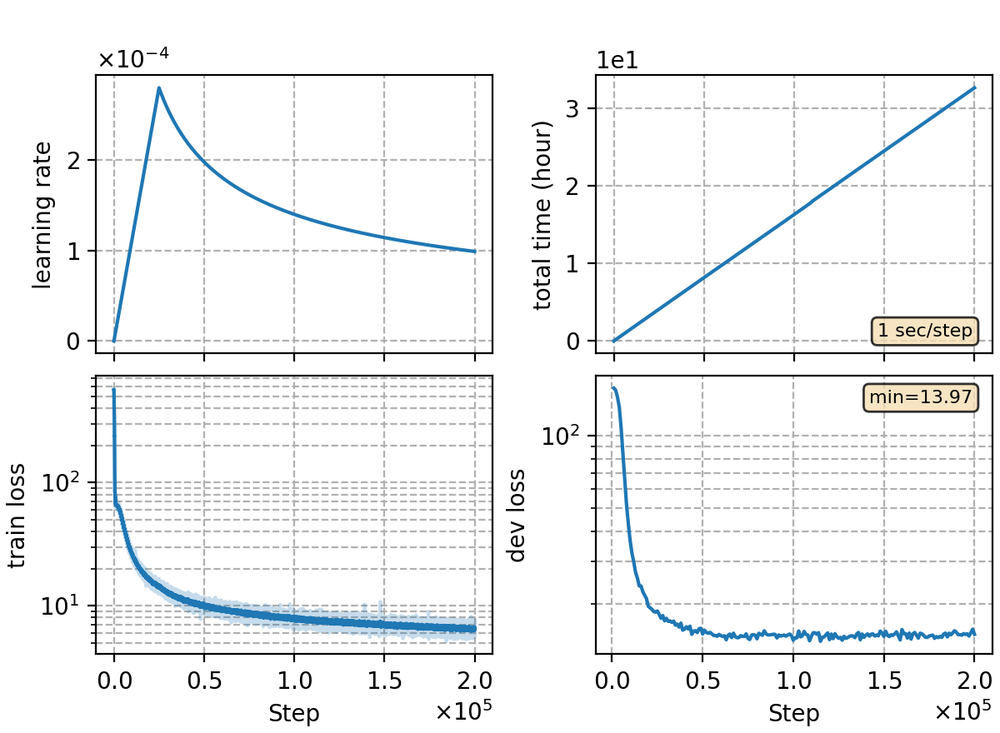

### Basic info

**This part is auto-generated, add your details in Appendix**

* Model size/M: 91.67
* GPU info \[10\]
  * \[10\] NVIDIA GeForce RTX 3090

### Appendix

* wenet-m 1k hours, with torchaudio feat extraction and CMVN, ported from `rnnt/rnnt-v1`

### Result
```
best 20
dev     %SER 71.91 | %CER 11.38 [ 37615 / 330498, 1314 ins, 15695 del, 20606 sub ]
test_net        %SER 67.12 | %CER 13.30 [ 55310 / 415747, 1942 ins, 13029 del, 40339 sub ]
test_meeting    %SER 92.08 | %CER 20.88 [ 46023 / 220385, 1198 ins, 20907 del, 23918 sub ]

last 20
dev     %SER 71.59 | %CER 11.60 [ 38352 / 330498, 1226 ins, 18226 del, 18900 sub ]
test_net        %SER 65.42 | %CER 12.68 [ 52720 / 415747, 1794 ins, 14072 del, 36854 sub ]
test_meeting    %SER 92.22 | %CER 21.33 [ 47004 / 220385, 1108 ins, 24737 del, 21159 sub ]
```

### Monitor figure

