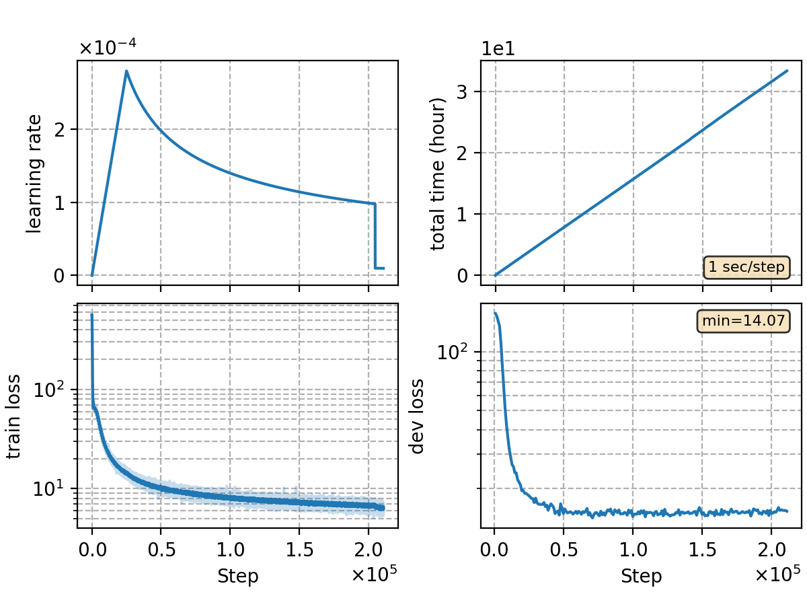

### Basic info

**This part is auto-generated, add your details in Appendix**

* Model size/M: 91.67
* GPU info \[9\]
  * \[9\] NVIDIA GeForce RTX 3090

### Appendix

* wenet-m 1k hours with torchaudio, ported from `rnnt/rnnt-v1`
* data prep:
  ```bash
  # disable cmvn in local/data.sh
  bash local/data.sh
  ```

### Result

compared to baseline (feature extraction via kaldi)

| feat. extract       | dev   | test_net | test_meeting |
| ------------------- | :---: | :------: | :----------: |
| kaldi w/ CMVN       | 11.16 | 12.76    | 20.97        |
| torchaudio w/o CMVN | 11.34 | 13.11    | 20.51        |

```
best-10
dev             %SER 72.05 | %CER 11.34 [ 37489 / 330498, 1284 ins, 15111 del, 21094 sub ]
test_net        %SER 66.57 | %CER 13.11 [ 54516 / 415747, 2010 ins, 12246 del, 40260 sub ]
test_meeting    %SER 92.20 | %CER 20.51 [ 45200 / 220385, 1291 ins, 19222 del, 24687 sub ]

last-20
dev     %SER 71.78 | %CER 11.55 [ 38168 / 330498, 1170 ins, 18136 del, 18862 sub ]
test_net        %SER 64.84 | %CER 12.43 [ 51664 / 415747, 1763 ins, 13819 del, 36082 sub ]
test_meeting    %SER 91.60 | %CER 20.62 [ 45434 / 220385, 1002 ins, 23384 del, 21048 sub ]
```

### Monitor figure

