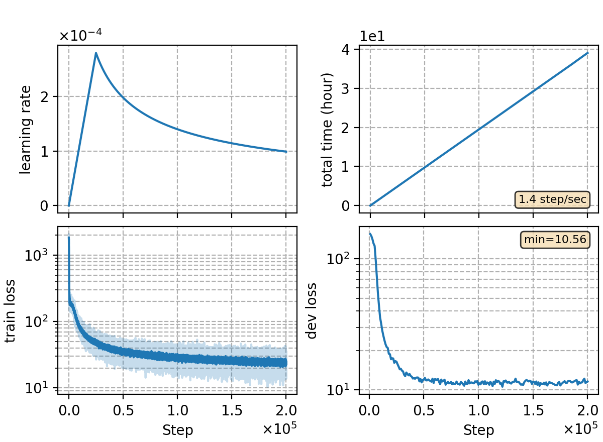

### Basic info

**This part is auto-generated, add your details in Appendix**

* \# of parameters (million): 91.88
* GPU info \[8\]
  * \[8\] NVIDIA GeForce RTX 3090

### Notes

* perform worse compared to baseline `rnnt-v1` with syllable embeddings.

### Result
```
dev     %SER 72.34 | %CER 11.73 [ 38770 / 330498, 1210 ins, 17047 del, 20513 sub ]
test_net        %SER 67.34 | %CER 13.37 [ 55590 / 415746, 1909 ins, 13540 del, 40141 sub ]
test_meeting    %SER 92.21 | %CER 21.55 [ 47503 / 220385, 1241 ins, 22074 del, 24188 sub ]
aishell-test    %SER 52.83 | %CER 7.80 [ 8167 / 104765, 269 ins, 279 del, 7619 sub ]
```

|     training process    |
|:-----------------------:|
||
