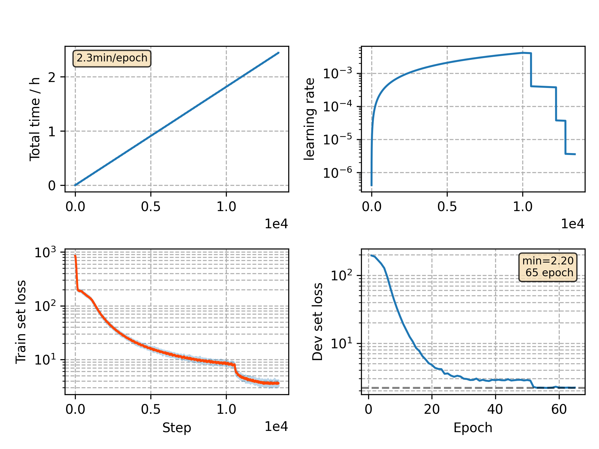

### Basic info

**This part is auto generated, add your details in Appendix**

* Model size/M: 10.33
* GPU info \[9\]
  * \[9\] GeForce RTX 3090

### Appendix

* `v9` + 10 time masks

### WER
```
%WER 30.14 [ 1718 / 5700, 176 ins, 358 del, 1184 sub ]
%WER 33.43 [ 2786 / 8334, 300 ins, 603 del, 1883 sub ]
```

### Monitor figure

