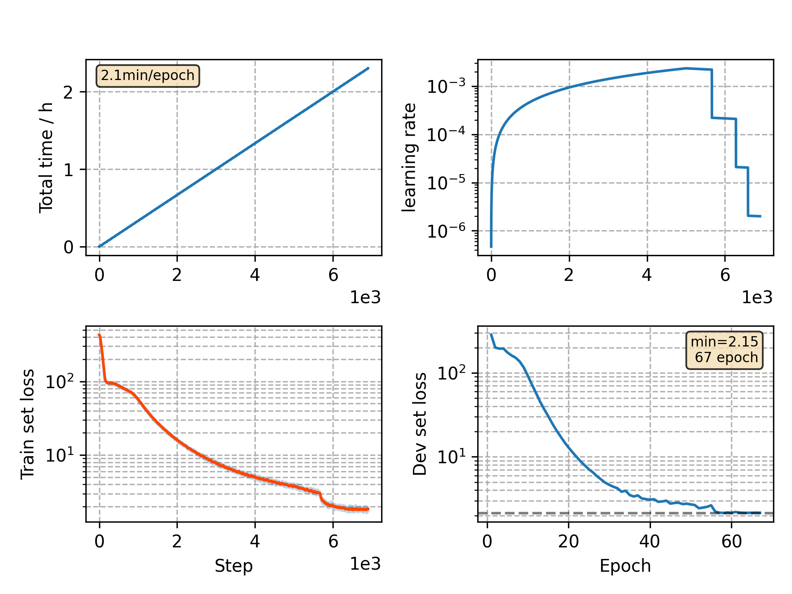

### Basic info

**This part is auto generated, add your details in Appendix**

* Model size/M: 10.33
* GPU info \[9\]
  * \[9\] GeForce RTX 3090

### Appendix

* `v8` + 2 times batch size + 2 times peak lr

### WER
```
%WER 19.93 [ 1136 / 5700, 128 ins, 212 del, 796 sub ]
%WER 22.82 [ 1902 / 8334, 215 ins, 329 del, 1358 sub ]
```

### Monitor figure

