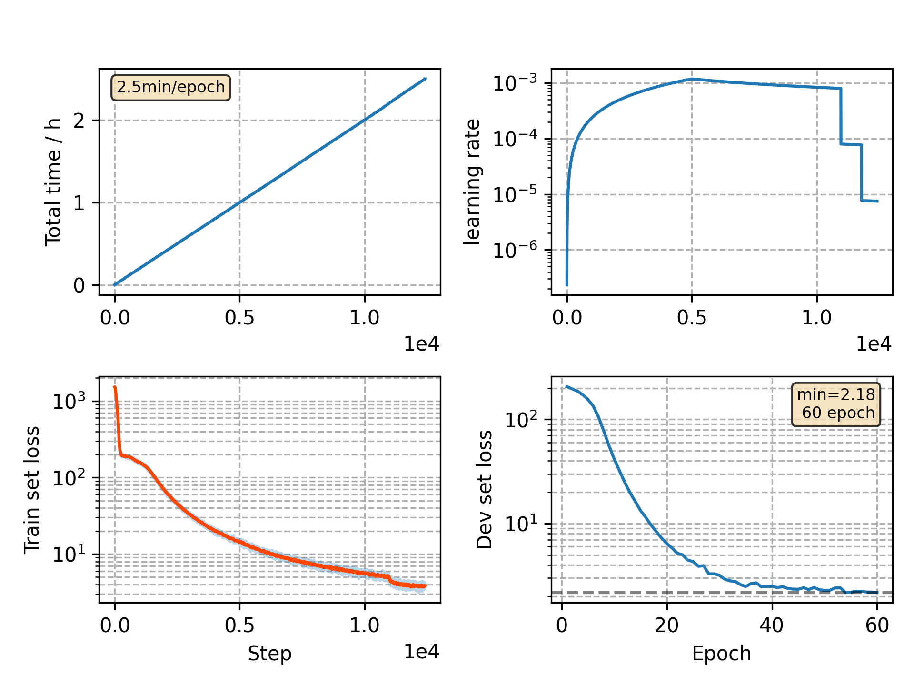

### Basic info

**This part is auto generated, add your details in Appendix**

* Model size/M: 10.33
* GPU info \[9\]
  * \[9\] GeForce RTX 3090

### Appendix

* `v8` + no time reduction

### WER
```
%WER 18.93 [ 1079 / 5700, 77 ins, 268 del, 734 sub ]
%WER 22.05 [ 1838 / 8334, 148 ins, 450 del, 1240 sub ]
```

### Monitor figure

