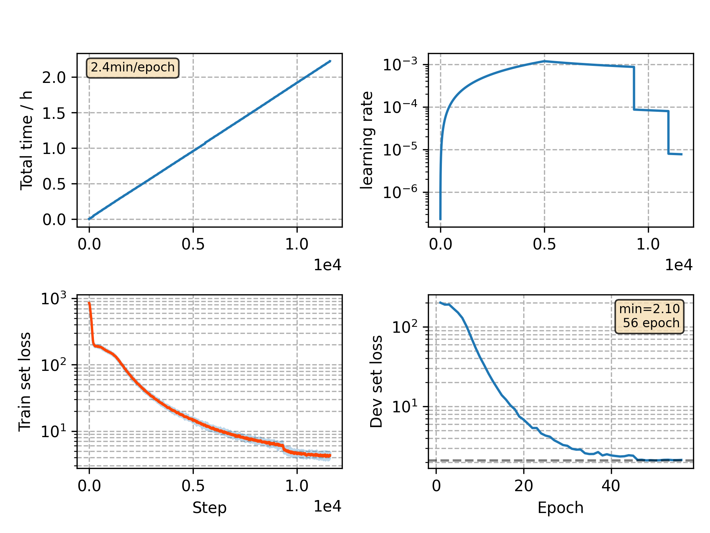

### Basic info

**This part is auto generated, add your details in Appendix**

* Model size/M: 10.33
* GPU info \[9\]
  * \[9\] GeForce RTX 3090

### Appendix

* `v8` + no zero optimizer

### WER
```
%WER 17.96 [ 1024 / 5700, 92 ins, 183 del, 749 sub ]
%WER 21.19 [ 1766 / 8334, 182 ins, 310 del, 1274 sub ]
```

### Monitor figure

