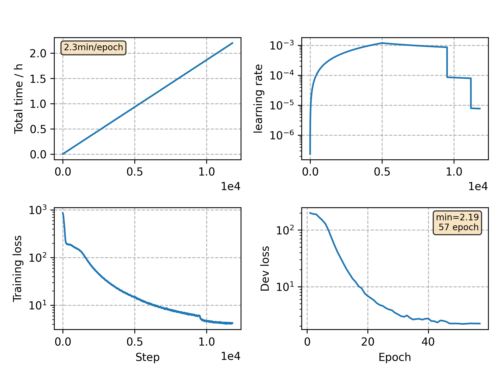

### Basic info

**This part is auto generated, add your details in Appendix**

* Model size/M: 10.33
* GPU info \[9\]
  * \[9\] GeForce RTX 3090

### Appendix

* `v8` + batchnorm in conv2dsubsample layer

### WER
```

```

### Monitor figure

