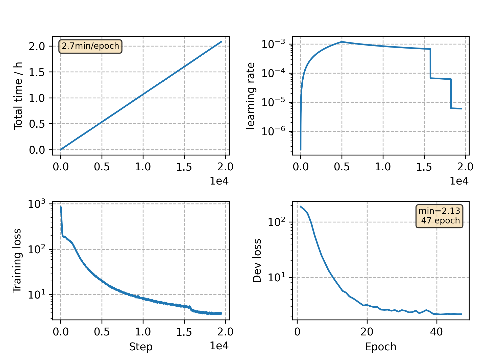

### Basic info

**This part is auto generated, add your details in Appendix**

* Model size/M: 10.33
* GPU info \[9\]
  * \[9\] GeForce RTX 3090

### Appendix

* `v8` + 256 batch size

### WER
```
%WER 18.47 [ 1053 / 5700, 95 ins, 190 del, 768 sub ]
%WER 20.65 [ 1721 / 8334, 204 ins, 280 del, 1237 sub ]
```

### Monitor figure

