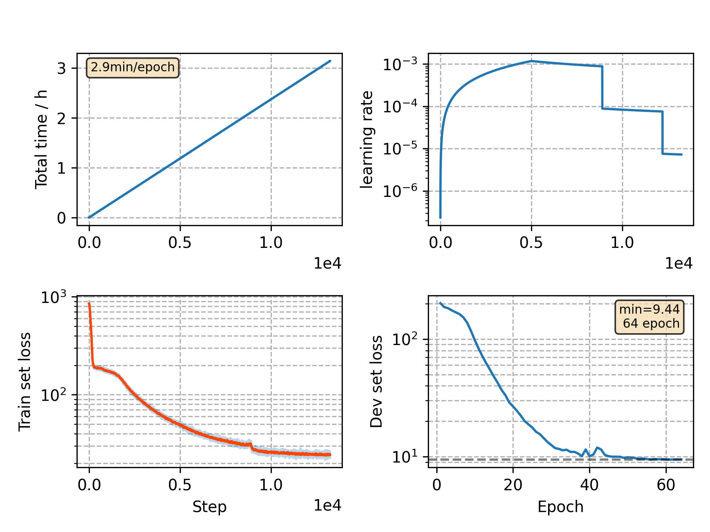

### Basic info

**This part is auto generated, add your details in Appendix**

* Model size/M: 10.33
* GPU info \[9\]
  * \[9\] GeForce RTX 3090

### Appendix

* no mixed precision training

### WER
```
%WER 18.05 [ 1029 / 5700, 96 ins, 214 del, 719 sub ]
%WER 21.84 [ 1820 / 8334, 252 ins, 347 del, 1221 sub ]
```

### Monitor figure

