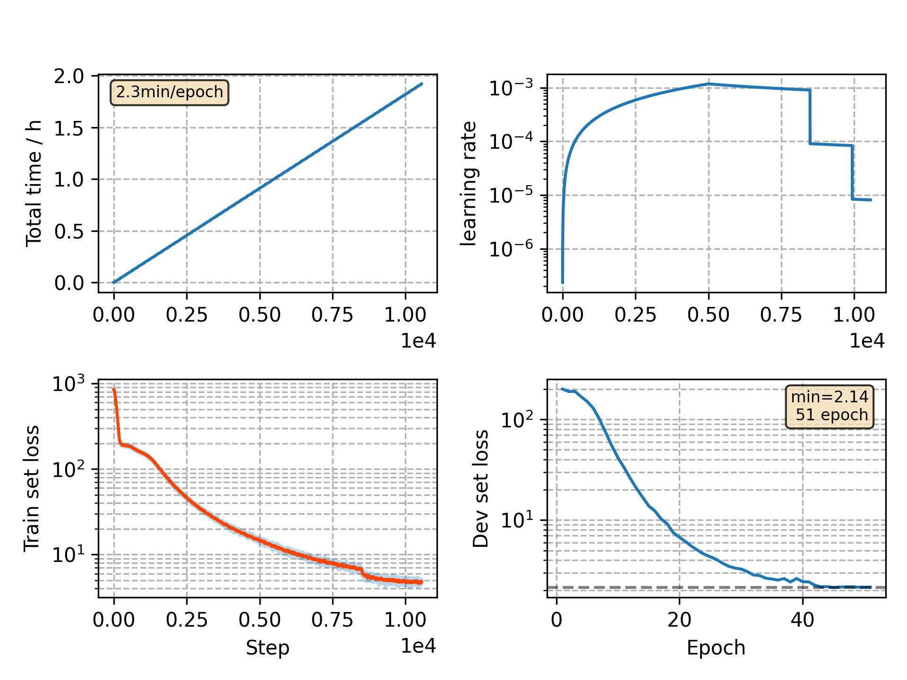

### Basic info

**This part is auto generated, add your details in Appendix**

* Model size/M: 10.33
* GPU info \[9\]
  * \[9\] GeForce RTX 3090

### Appendix

* `v5` + normalize loss + torch -> 1.9.1

### WER
```
%WER 17.81 [ 1015 / 5700, 96 ins, 171 del, 748 sub ]
%WER 20.15 [ 1679 / 8334, 209 ins, 284 del, 1186 sub ]
```

### Monitor figure

