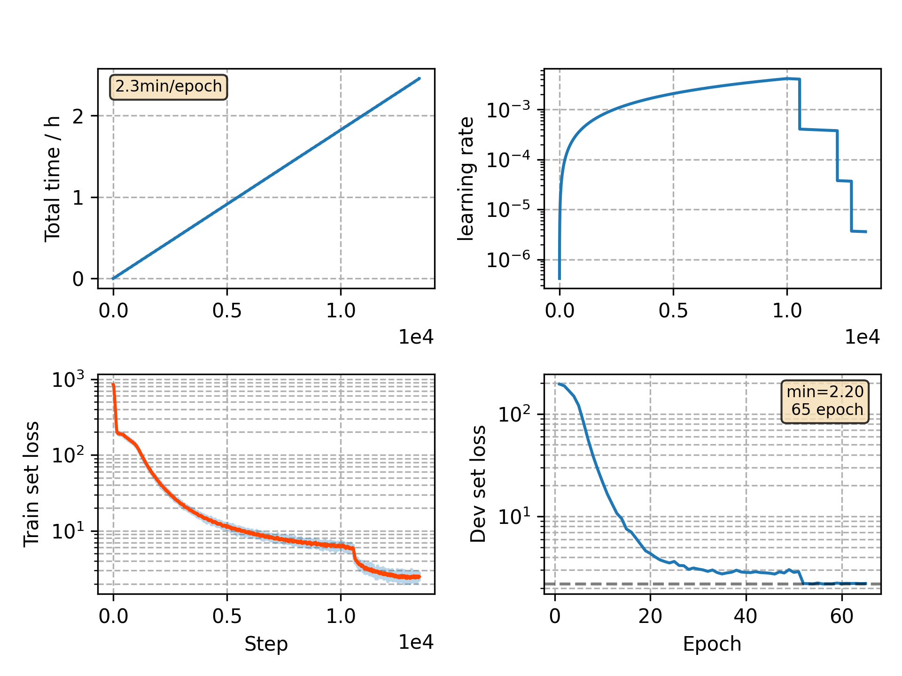

### Basic info

**This part is auto generated, add your details in Appendix**

* Model size/M: 10.33
* GPU info \[9\]
  * \[9\] GeForce RTX 3090

### Appendix

* `v8` + 10k warmup + 5.0 peak

### WER
```
%WER 23.89 [ 1362 / 5700, 130 ins, 276 del, 956 sub ]
%WER 28.79 [ 2399 / 8334, 257 ins, 477 del, 1665 sub ]
```

### Monitor figure

