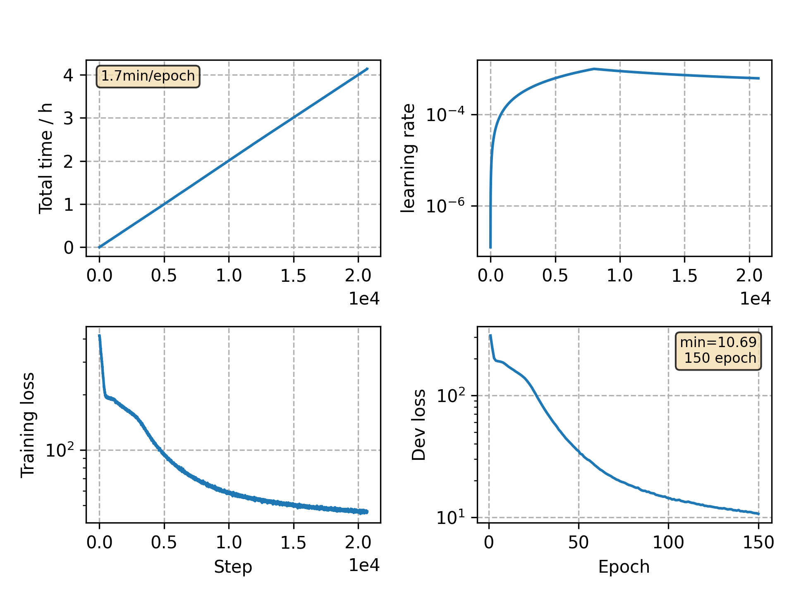

### Basic info

**This part is auto generated, add your details in Appendix**

* Model size/M: 3.41
* GPU info \[4\]
  * \[4\] Tesla P100-PCIE-16GB

### Appendix

* This is a template of English.

### WER
```
Use CPU = False
test_eval92 ext_lm= %WER 26.05 [1485 / 5700, 211 ins, 250 del, 1024 sub ]
test_dev93 ext_lm= %WER 30.63 [2553 / 8334, 392 ins, 377 del, 1784 sub ]

Custom checkpoint: avg_best_10.pt
Use CPU = False
test_eval92 ext_lm= %WER 25.26 [1440 / 5700, 196 ins, 243 del, 1001 sub ]
test_dev93 ext_lm= %WER 30.05 [2504 / 8334, 408 ins, 352 del, 1744 sub ]

Custom checkpoint: avg_last_10.pt
Use CPU = False
test_eval92 ext_lm= %WER 25.28 [1441 / 5700, 197 ins, 246 del, 998 sub ]
test_dev93 ext_lm= %WER 30.23 [2519 / 8334, 397 ins, 363 del, 1759 sub ]
```

### Monitor figure

